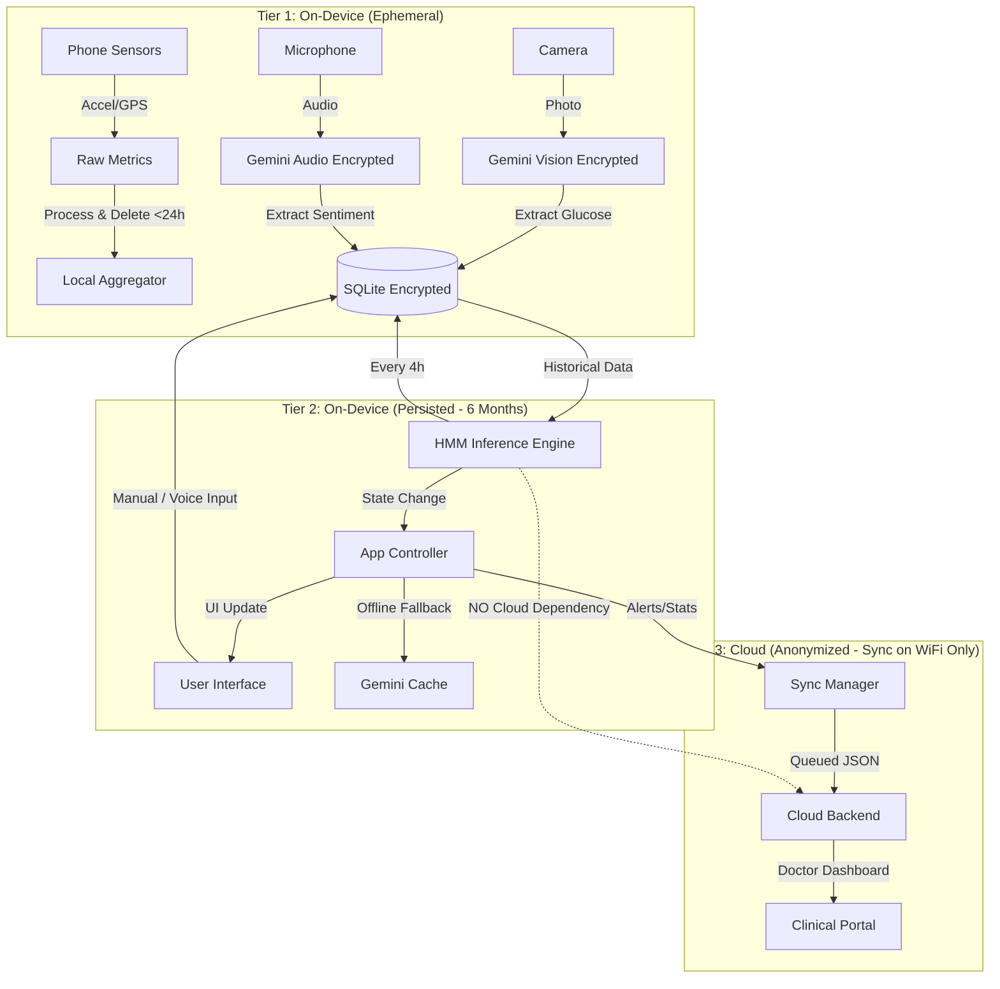
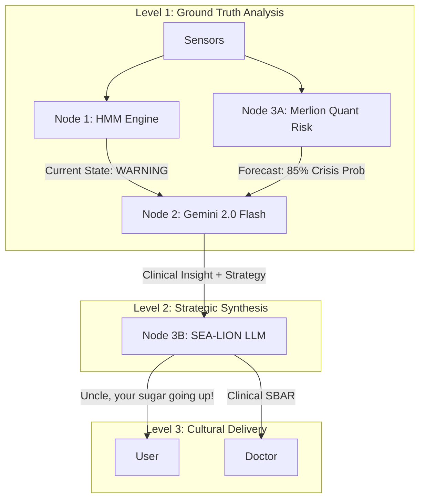

# Bewo System Architecture

## 1. High-Level Data Flow (Offline-First)

## 2. Privacy & Data Handling Tiers

| Tier | Scope | Storage Policy | Examples |
|------|-------|----------------|----------|
| **Tier 1** | **Ephemeral (RAM/Temp)** | **NEVER LEAVES DEVICE**. Auto-delete after processing (max 24h). | Raw Accelerometer, Raw GPS, Voice Audio, Photos. |
| **Tier 2** | **Private Persisted** | **NEVER LEAVES DEVICE**. Encrypted SQLite. Retain 6 months. | Glucose values, Med logs, Voice transcripts, HMM User States. |
| **Tier 3** | **Cloud Sync** | **SYNC ON WIFI ONLY**. Anonymized & Aggregated. Indefinite retention. | "Crisis Alert Event" (No values), Weekly Adherence %, Voucher Redemptions. |

### Cloud Sync Policy (CRITICAL)
**STRICTLY FORBIDDEN FROM CLOUD SYNC:**
*   Raw sensor data (accelerometer, GPS, audio, images).
*   Individual glucose readings (e.g., "5.4 mmol/L at 8:00 AM").
*   Full voice transcripts.
*   Precise location history.

**PERMITTED FOR CLOUD SYNC (WiFi Only):**
*   **Alert Events**: `{"user_id": "U123", "event": "CRISIS_STATE", "ts": 1709...}`
*   **Aggregated Stats**: `{"user_id": "U123", "week_avg_glucose": 6.5, "med_adherence": 0.9}`
*   **Interventions**: `{"intervention": "NUDGE", "response": "ACCEPTED"}`
*   **Vouchers**: `{"redeem": "VOUCHER_5_DOLLAR"}`

## 3. Offline Guarantees
**The System is designated as "Offline-First".**
1.  **HMM Inference**: Runs 100% locally on the Android device using Python (Chaquopy/PyDroid) and SQLite. **Zero cloud dependency** for health state detection.
2.  **App Functionality**: All core features (tracking, dashboards, local alerts) work without internet.
3.  **Sync**: All Tier 3 data is queued locally in `interventions_log` / `voucher_redemptions` and synced only when connection is restored.

## 4. The "Diamond" Agentic Architecture (Node 1-2-3)

To solve the "Deep Tech" challenge, we essentially split the brain into specialized lobes:

### Component Roles
1.  **Node 1 (HMM)**: *The Guardian*. Deterministic state detection. Safety critical.
2.  **Node 3A (Merlion)**: *The Quant*. Statistical forecasting (CVaR). Calculates "Probability of Ruin" (Crisis).
3.  **Node 2 (Gemini)**: *The Doctor*. Synthesizes state + risk to form a strategy. (e.g., "High risk of hypoglycemia, so recommend fast-acting carbs").
4.  **Node 3B (Sea-Lion)**: *The Translator*. Converts the Doctor's strategy into the user's specific linguistic register (Singlish/Dialect).

### Fallback Hierarchy
1.  **Primary**: Diamond Flow (All Nodes Active).
2.  **Fallback 1 (No Cloud)**: HMM (Local) -> Simple Rule-Based Alerts -> UI.
3.  **Fallback 2 (No Merlion)**: HMM -> Gemini -> User (Standard English).

## 5. Demo Robustness ("God Mode")
A hidden administrative panel for judges to verify system capabilities instantly.

*   **Time Travel Simulation**:
    *   **Action**: "Inject 7 Days Data" button.
    *   **Effect**: Populates `glucose_readings`, `medication_logs`, `passive_metrics` with 7 days of realistic timestamps (t-7d to now).
*   **Scenario Injection**:
    *   **"Crisis Now"**: Sets HMM input params to critical threshold (High Glucose + Missed Meds) -> Triggers immediate CRISIS state.
    *   **"Healthy Now"**: Resets inputs to baseline.
*   **Reset**: Wipes all tables (`DELETE FROM ...`) to clean state.
*   **State Inspector**: Toggle to show raw HMM confidence scores and input vectors on the dashboard.
